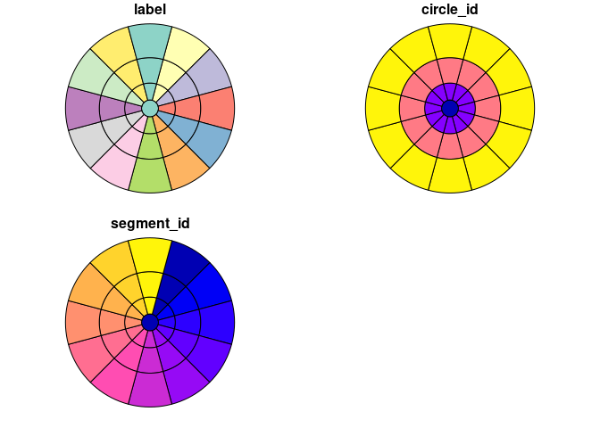
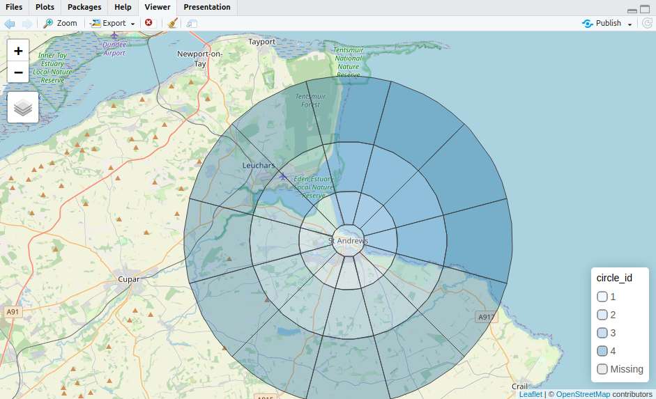
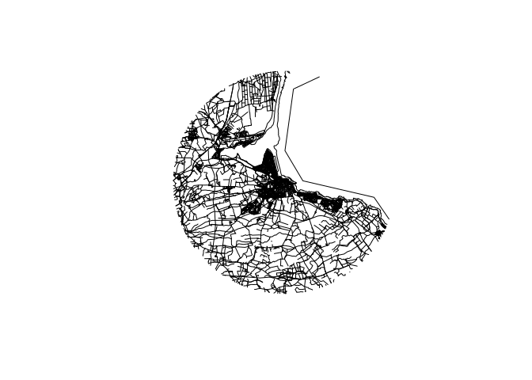
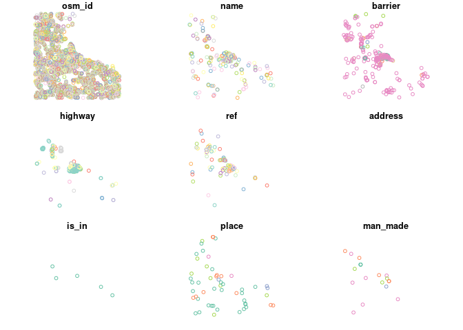
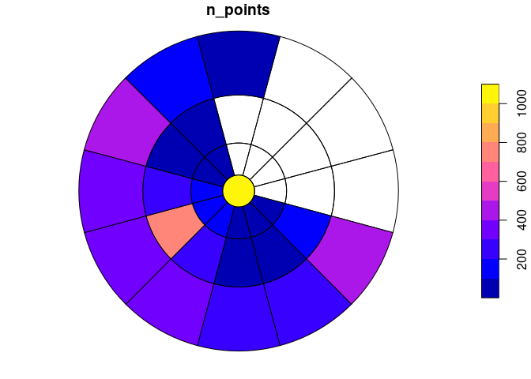
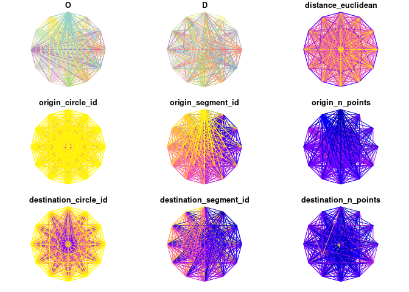
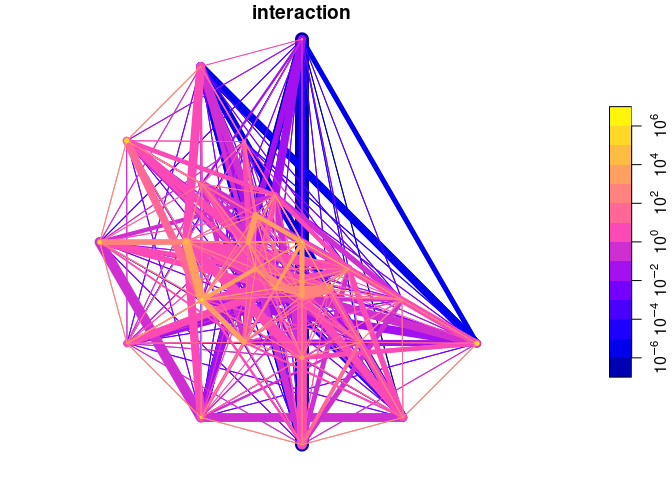

# Origin destination datasets and spatial interaction models


``` r
if (!requireNamespace("pak", quietly = TRUE)) {
  install.packages("pak")
}
pkgs = c(
  "sf",
  "osmextract",
  "tidyverse",
#   "spanishoddata",
  "od",
  "simodels",
  "zonebuilder",
  "tmap"
)
```

Install the packages as follows:

``` r
pak::pak(pkgs, upgrade = FALSE)
```

We’ll load the packages as follows:

``` r
purrr::walk(pkgs, library, character.only = TRUE)
```

    Linking to GEOS 3.12.1, GDAL 3.8.4, PROJ 9.3.1; sf_use_s2() is TRUE

    Data (c) OpenStreetMap contributors, ODbL 1.0. https://www.openstreetmap.org/copyright.
    Check the package website, https://docs.ropensci.org/osmextract/, for more details.

    ── Attaching core tidyverse packages ──────────────────────── tidyverse 2.0.0 ──
    ✔ dplyr     1.1.4     ✔ readr     2.1.5
    ✔ forcats   1.0.0     ✔ stringr   1.5.1
    ✔ ggplot2   3.5.1     ✔ tibble    3.2.1
    ✔ lubridate 1.9.4     ✔ tidyr     1.3.1
    ✔ purrr     1.0.4     
    ── Conflicts ────────────────────────────────────────── tidyverse_conflicts() ──
    ✖ dplyr::filter() masks stats::filter()
    ✖ dplyr::lag()    masks stats::lag()
    ℹ Use the conflicted package (<http://conflicted.r-lib.org/>) to force all conflicts to become errors

We’ll also install the `osmactive` package:

``` r
pak::pak("nptscot/osmactive")
```

    ℹ Loading metadata database

    ✔ Loading metadata database ... done

     

    ✔ All system requirements are already installed.

      

    ℹ No downloads are needed

    ✔ 1 pkg + 53 deps: kept 45 [3.3s]

And let’s switch tmap to interactive plotting mode:

``` r
tmap_mode("view")
```

    ℹ tmap mode set to "view".

We’ll use the `osmextract` package to download OpenStreetMap data for St
Andrews. Set the `osmextract` download directory if it’s not already
set.

``` r
# ?oe_download_directory
# usethis::edit_r_environ()
Sys.getenv("OSMEXT_DOWNLOAD_DIRECTORY")
```

    [1] "/data/bronze/osm"

Let’s get a polygon representing St Andrews and its surroundings

``` r
# Radius of circles is 1, 3, 6, 10 km
st_andrews_zones = zb_zone("St Andrews", n_circles = 4)
names(st_andrews_zones)
```

    [1] "label"      "circle_id"  "segment_id" "geometry"   "centroid"  

``` r
st_andrews_zones = st_andrews_zones |>
  select(label, circle_id, segment_id)
plot(st_andrews_zones)
```



Let’s check the zones are in the right place with an interactive plot:

``` r
tm_shape(st_andrews_zones) +
  tm_polygons("circle_id", alpha = 0.3)
```



``` r
st_andrews_region = sf::st_union(st_andrews_zones)
st_andrews_osm = oe_get("Scotland", boundary = st_andrews_region, boundary_type = "clipsrc")
```

    The input place was matched with: Scotland

    The chosen file was already detected in the download directory. Skip downloading.

    Starting with the vectortranslate operations on the input file!

    0...10...20...30...40...50...60...70...80

    Warning in CPL_gdalvectortranslate(source, destination, options, oo, doo, :
    GDAL Message 1: A geometry of type MULTILINESTRING is inserted into layer lines
    of geometry type LINESTRING, which is not normally allowed by the GeoPackage
    specification, but the driver will however do it. To create a conformant
    GeoPackage, if using ogr2ogr, the -nlt option can be used to override the layer
    geometry type. This warning will no longer be emitted for this combination of
    layer and feature geometry type.

    ...90...100 - done.

    Finished the vectortranslate operations on the input file!

    Reading layer `lines' from data source 
      `/data/bronze/osm/geofabrik_scotland-latest.gpkg' using driver `GPKG'
    Simple feature collection with 10284 features and 10 fields
    Geometry type: MULTILINESTRING
    Dimension:     XY
    Bounding box:  xmin: -2.957215 ymin: 56.25058 xmax: -2.643051 ymax: 56.43018
    Geodetic CRS:  WGS 84

``` r
st_andrews_osm |> 
  sf::st_geometry() |>
  plot()
```



We can get more specific bits of OSM with the `osmextract` package as
follows:

# Challenges

## Challenge 1: Obtaining population data for St Andrews

1.  Obtain population estimates from the 2021 Census at the small area
    level and download them onto your computer
2.  Import them into R
3.  Download and import corresponding boundary data
4.  Subset the the census population data to the St Andrews study area
5.  Join the population data with the boundary data
6.  Plot the total number of people living in each administrative zone
    in the surroundings of St Andrews
7.  Plot the population density in each administrative zone in the
    surroundings of St Andrews
8.  Use a spatial join function (e.g. `st_join()` in `sf` or `sjoin()`
    in `geopandas`) to join the population data with the
    `st_andrews_zones` dataset and plot the results

## Challenge 2: Getting trip attractors for St Andrews

1.  Generate, explore and describe a dataset representing trip
    attractors in and around St Andrews

``` r
osm_points = oe_get(
  "Scotland",
  boundary = st_andrews_region,
  layer = "points"
)
```

    The input place was matched with: Scotland

    The chosen file was already detected in the download directory. Skip downloading.

    Starting with the vectortranslate operations on the input file!

    0...10...20...30...40...50...60...70...80...90...100 - done.

    Finished the vectortranslate operations on the input file!

    Reading layer `points' from data source 
      `/data/bronze/osm/geofabrik_scotland-latest.gpkg' using driver `GPKG'
    Simple feature collection with 7354 features and 10 fields
    Geometry type: POINT
    Dimension:     XY
    Bounding box:  xmin: -2.957282 ymin: 56.2506 xmax: -2.634051 ymax: 56.43019
    Geodetic CRS:  WGS 84

``` r
plot(osm_points)
```

    Warning: plotting the first 9 out of 10 attributes; use max.plot = 10 to plot
    all



``` r
st_andrews_n_points = osm_points |>
  sf::st_join(st_andrews_zones) |>
  sf::st_drop_geometry() |>
  group_by(label) |>
  summarise(
    n_points = n()
  )
st_andrews_ze = left_join(
  st_andrews_zones,
  st_andrews_n_points
) 
```

    Joining with `by = join_by(label)`

``` r
st_andrews_ze |>
  select(n_points) |> 
  plot()
```



## Challenge 3: Generate and explore spatial interaction models for St Andrews

Run the code below, play with the inputs and try to generate a more
realistic SIM (see the documentation for the `simodels` R package)

``` r
od = simodels::si_to_od(
  origins = st_andrews_ze,
  destinations = st_andrews_ze
)
```

    Converting p to centroids

``` r
plot(od)
```



``` r
names(od)
```

     [1] "O"                      "D"                      "distance_euclidean"    
     [4] "origin_circle_id"       "origin_segment_id"      "origin_n_points"       
     [7] "destination_circle_id"  "destination_segment_id" "destination_n_points"  
    [10] "geometry"              

``` r
summary(od)
```

          O                  D             distance_euclidean origin_circle_id
     Length:1369        Length:1369        Min.   :    0      Min.   :1.000   
     Class :character   Class :character   1st Qu.: 4129      1st Qu.:2.000   
     Mode  :character   Mode  :character   Median : 6530      Median :3.000   
                                           Mean   : 6805      Mean   :2.946   
                                           3rd Qu.: 9274      3rd Qu.:4.000   
                                           Max.   :16113      Max.   :4.000   
                                                                              
     origin_segment_id origin_n_points  destination_circle_id
     Min.   : 0.000    Min.   :  20.0   Min.   :1.000        
     1st Qu.: 3.000    1st Qu.:  70.0   1st Qu.:2.000        
     Median : 6.000    Median : 166.0   Median :3.000        
     Mean   : 6.324    Mean   : 235.7   Mean   :2.946        
     3rd Qu.: 9.000    3rd Qu.: 322.0   3rd Qu.:4.000        
     Max.   :12.000    Max.   :1065.0   Max.   :4.000        
                       NA's   :407                           
     destination_segment_id destination_n_points          geometry   
     Min.   : 0.000         Min.   :  20.0       LINESTRING   :1369  
     1st Qu.: 3.000         1st Qu.:  70.0       epsg:4326    :   0  
     Median : 6.000         Median : 166.0       +proj=long...:   0  
     Mean   : 6.324         Mean   : 235.7                           
     3rd Qu.: 9.000         3rd Qu.: 322.0                           
     Max.   :12.000         Max.   :1065.0                           
                            NA's   :407                              

``` r
gravity_model = function(beta, d, m, n) {
  m * n * exp(-beta * d / 1000)
} 
# perform SIM
od_res = si_calculate(
  od,
  fun = gravity_model,
  d = distance_euclidean,
  m = origin_n_points,
  n = destination_n_points,
  beta = 1.5
)
```

``` r
od_res |> 
  select(interaction) |> 
  arrange(interaction) |>
  plot(logz = TRUE, lwd = log(od_res$interaction))
```



## Challenge 4: Downloading large OD datasets with `spanishoddata` R package

Check out the documentation of the package and try to download some data
showing

- Flows between Madrid and Barcelona
- Flow between Madrid and Valencia
- Flows between Barcelona and Valencia

Which has the most flows?

Come up with some research questions and explore them
